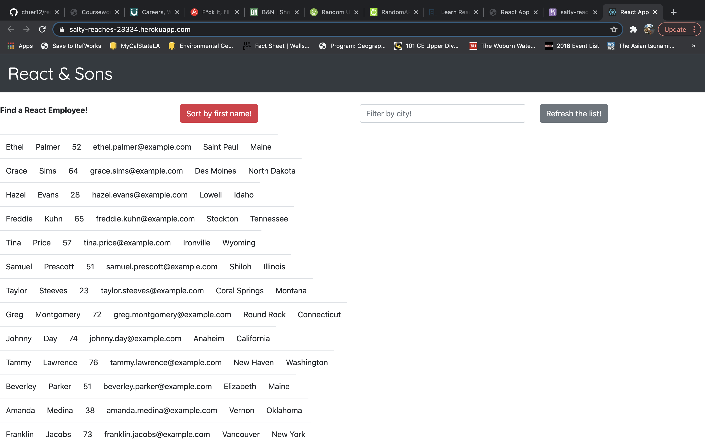
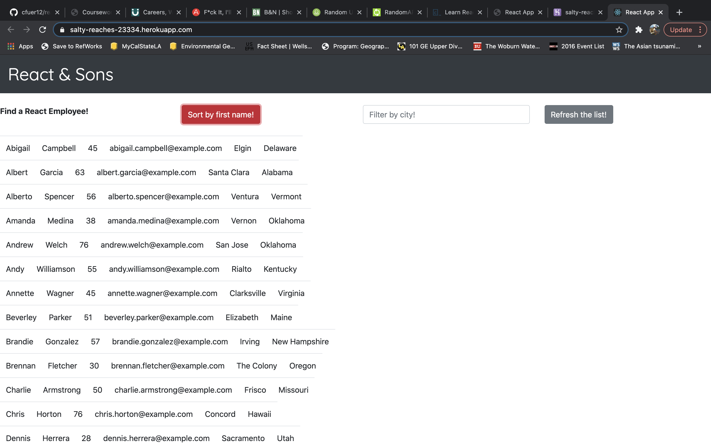
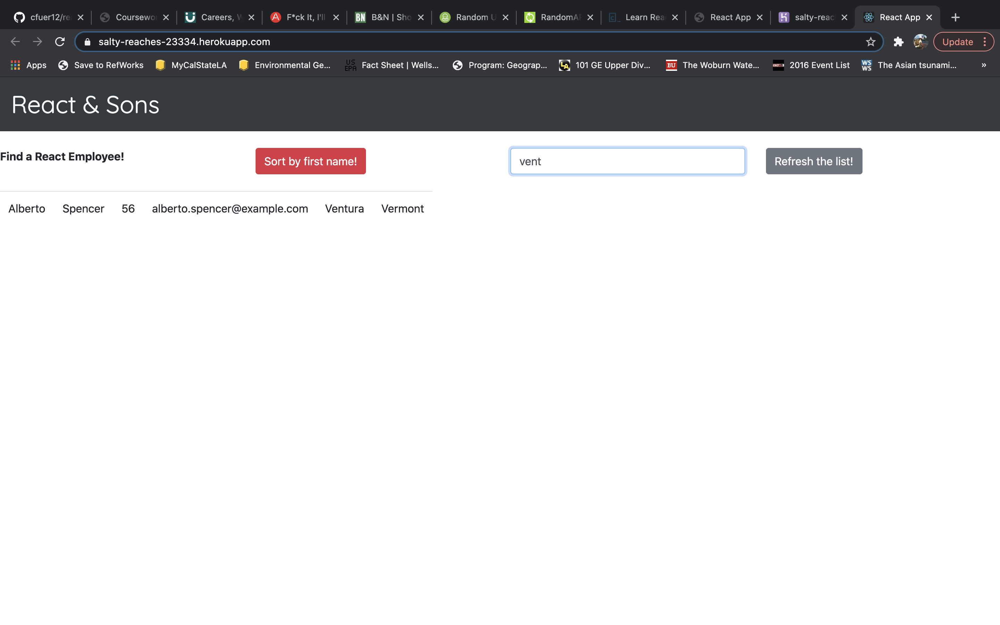

# employeeDirectory
Create an employee directory with React. This assignment will require you to break up your application's UI into components, manage component state, and respond to user events.

  * [Description](#description)
  * [Installation](#installation)
  * [Usage](#usage)
  * [License](#license)
  * [Contributions](#contributions)
  * [Questions](#questions)
  * [Screenshot](#screenshot)
  
  ## Description
  For this assignment, you'll create a employee directory with React. This assignment will require you to break up your application's UI into components, manage component state, and respond to user events. You have to sort the table by at least one category and one property. I was able to create this and make the sorting process happen, but the only struggle i still have with react is some syntax properties. For example in the creation of the app.js file, in making the front end of the app show up, i was confused on how to get that going and line up the files/properties correctly for the front end part. Need some more practice with it.

  Check the deployed site [here](https://salty-reaches-23334.herokuapp.com/)
  
  ## Installation
  install required npm packages. run "npm start" in terminal to have to app running in browser.
  
  ## Usage
  classwork
  
  ## License
  MIT
  
  ## Contributions
  Was made possible with guidance from classmates, as I was stuck in certain areas.

  ## Questions
  Click [here](https://github.com/cfuer12) to visit my Github profile.
  Or email all questions to: cfuer12@yahoo.com

  ## Screenshot
  
  
  